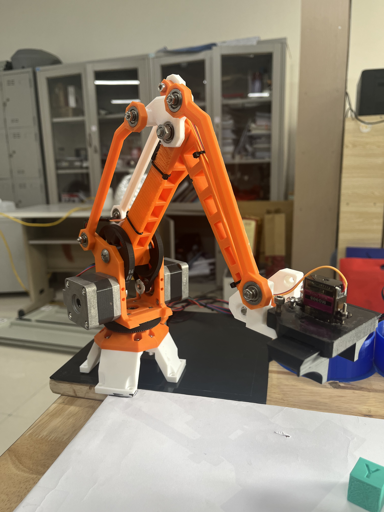
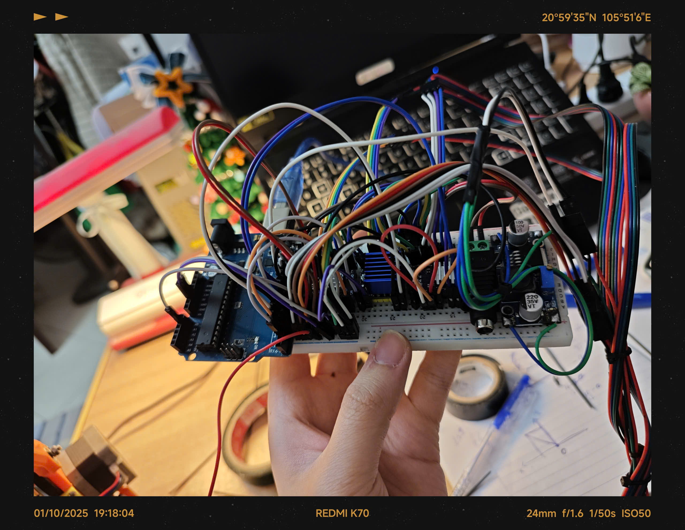

# 🤖 Cánh Tay Robot 3 Bậc Tự Do (3-DOF Robotic Arm)

Dự án điều khiển cánh tay robot 3 bậc tự do sử dụng Arduino Uno và động cơ bước TMC2208, tích hợp xử lý hình ảnh để nhận diện và phân loại vật thể theo màu sắc.



## ✨ Tính Năng

- ✅ **Điều khiển 3 trục tự do** với động cơ bước chính xác cao
- ✅ **Động học ngược (Inverse Kinematics)** tính toán chính xác vị trí
- ✅ **Nhặt và phân loại vật thể** theo màu sắc (GREEN/YELLOW)
- ✅ **Vẽ hình tự động**: vẽ hình tim, đường thẳng
- ✅ **Tự động về vị trí home** với các công tắc hành trình
- ✅ **Gripper servo** mở/đóng để gắp vật

## 🎥 Video Demo

<!-- Chèn link video TikTok tại đây -->
[Xem video demo trên TikTok](https://www.tiktok.com/@state.of.the.art_2707/video/7463148240872017170)

## 🔧 Linh Kiện Phần Cứng

### Vi điều khiển & Driver
- **Arduino Uno** - board điều khiển chính
- **TMC2208** (x3) - driver động cơ bước chế độ microstepping

### Động cơ & Cơ Khí
- **Động cơ bước NEMA 17** (x3) - điều khiển 3 trục
- **Servo motor** (x1) - điều khiển gripper
- **Công tắc hành trình** (x3) - xác định vị trí home

### Kích Thước Cánh Tay (mm)
```
a = 54.12 mm  - Khoảng cách từ trục 1 đến trục 2
b = 140.00 mm - Chiều dài khâu 2
c = 140.00 mm - Chiều dài khâu 3
d = 21.70 mm  - Độ lệch Z của gripper
```

## 📐 Sơ Đồ Kết Nối

### Kết nối TMC2208 Drivers

| Arduino Pin | Chức Năng | Stepper 1 | Stepper 2 | Stepper 3 |
|-------------|-----------|-----------|-----------|-----------|
| A1 / 6 / 9  | EN (Enable) | S1_EN | S2_EN | S3_EN |
| 2 / 5 / 8   | STEP | S1_STEP | S2_STEP | S3_STEP |
| 3 / 4 / 7   | DIR (Direction) | S1_DIR | S2_DIR | S3_DIR |

### Kết nối khác
- **Pin 10**: Servo gripper
- **Pin 11-13**: Công tắc hành trình (S1_STOP, S2_STOP, S3_STOP)



## 💻 Cài Đặt

### 1. Cài đặt Arduino IDE
Tải và cài đặt [Arduino IDE](https://www.arduino.cc/en/software)

### 2. Cài đặt thư viện
Mở Arduino IDE và cài đặt các thư viện sau qua Library Manager:
- `Servo.h` (thường có sẵn)

### 3. Upload code
1. Mở file `3-DOF-Robot.ino`
2. Chọn board: **Arduino Uno**
3. Chọn đúng cổng COM
4. Nhấn **Upload**

## 🎮 Hướng Dẫn Sử Dụng

### Chế độ tự động (mặc định)
Sau khi khởi động, robot sẽ:
1. Tự động về vị trí **home** (sử dụng công tắc hành trình)
2. Thực hiện chức năng vẽ hình tim tự động

### Chế độ nhặt và phân loại vật thể
Để kích hoạt chế độ này, sửa trong hàm `loop()`:
```cpp
void loop() {
  pick_and_drop();  // Bỏ comment dòng này
  // draw_heart(...); // Comment dòng này
}
```

**Gửi dữ liệu qua Serial** (9600 baud):
```
x y z color\n
```
- `x, y, z`: tọa độ vật thể (mm)
- `color`: 1 = GREEN, 0 = YELLOW

**Ví dụ**:
```
150.5 200.0 -80.0 1
```

### Các vị trí phân loại
- **GREEN objects**: (288, -60, -50)
- **YELLOW objects**: (180, -60, -50)

## 📊 Thông Số Kỹ Thuật

| Thông số | Giá trị |
|----------|---------|
| Số bậc tự do | 3 DOF |
| Microstepping (S1, S2) | 1.8° → 0.045° (40 steps/degree) |
| Microstepping (S3) | 1.8° → 0.0225° (80 steps/degree) |
| Tốc độ motor | 250-600 µs/step |
| Baud rate Serial | 9600 |
| Servo range | 550-2420 µs (95°-180°) |
| Vùng làm việc | ~330 mm radius |

## 🧮 Động Học Ngược (Inverse Kinematics)

Hệ thống sử dụng thuật toán động học ngược để tính toán góc quay của từng khâu dựa trên tọa độ đích (x, y, z):

```cpp
// Góc phi (khâu 2)
phi = atan((z+d)/(√(x²+y²)-a)) + acos((c²+k-b²)/(2c√k))

// Góc alpha (khâu 3)
alpha = acos((c²+b²-k)/(2cb))

// Góc theta (trục xoay)
theta = 90° + atan2(x, y)
```

Với `k = (√(x²+y²)-a)² + (z+d)²`

## 🎨 Chức Năng Vẽ

### Vẽ hình tim
```cpp
draw_heart(num_points, size, servo_angle, x_origin, y_origin, z_origin);
```
- `num_points`: số điểm trên đường tim (1000 recommended)
- `size`: kích thước hình tim (scale factor)

### Vẽ đường thẳng
```cpp
draw_line(num_points, servo_angle, x1, y1, z1, x2, y2, z2);
```

## 🔍 Cấu Trúc Code

### Hàm chính
- `go_home()` - Di chuyển về vị trí home
- `go_to_pos()` - Di chuyển đến tọa độ (x,y,z)
- `pick_and_drop()` - Nhặt và phân loại vật thể
- `draw_heart()` - Vẽ hình tim
- `draw_line()` - Vẽ đường thẳng

### Biến trạng thái
- `s1_pos, s2_pos, s3_pos` - Vị trí hiện tại (degrees)
- `s1_angel, s2_angel, s3_angel` - Góc di chuyển tiếp theo
- `s1_num_steps, s2_num_steps, s3_num_steps` - Số bước cần thực hiện

## 🛠️ Hiệu Chỉnh & Tùy Chỉnh

### Điều chỉnh tốc độ
Thay đổi giá trị `s3_delay_us` để điều chỉnh tốc độ:
```cpp
uint16_t s3_delay_us = 250;  // Giảm = nhanh hơn, Tăng = chậm hơn
```

### Điều chỉnh microstepping
Sửa hệ số nhân trong hàm `go_to_pos()`:
```cpp
s1_num_steps = round(abs(s1_angel) * 40);  // 40 = steps per degree
s2_num_steps = round(abs(s2_angel) * 40);
s3_num_steps = round(abs(s3_angel) * 80);  // 80 cho độ chính xác cao hơn
```

### Cấu hình TMC2208
- Đặt chế độ microstepping bằng MS1/MS2 pins
- Khuyến nghị: 1/16 microstepping cho độ mịn tối ưu

## ⚠️ Lưu Ý

1. **Luôn thực hiện homing** trước khi điều khiển
2. **Kiểm tra giới hạn vùng làm việc** để tránh va chạm
3. **Nguồn điện**: Đảm bảo nguồn đủ mạnh cho 3 động cơ bước + servo
4. **Serial Monitor**: Mở để theo dõi trạng thái và debug
5. **Công tắc hành trình**: Kiểm tra kết nối INPUT_PULLUP

## 🐛 Xử Lý Sự Cố

| Vấn đề | Nguyên nhân | Giải pháp |
|--------|-------------|-----------|
| Robot không về home | Công tắc hành trình lỗi | Kiểm tra kết nối pin 11-13 |
| Động cơ rung nhưng không quay | Driver chưa được cấu hình | Kiểm tra MS1/MS2 và nguồn |
| Sai lệch vị trí | Bỏ bước (missed steps) | Giảm tốc độ, tăng `s3_delay_us` |
| Gripper không hoạt động | Servo không có tín hiệu | Kiểm tra pin 10 và nguồn servo |

## 📝 Tác Giả

- **Tên**: [Tên của bạn]
- **GitHub**: [@nguyenhoainam2707](https://github.com/nguyenhoainam2707)
- **TikTok**: [@your-tiktok-username](https://www.tiktok.com/@your-username)

## 📜 License

Dự án này được phát hành dưới giấy phép [MIT License](LICENSE)

## 🙏 Đóng Góp

Mọi đóng góp đều được hoan nghênh! Hãy:
1. Fork dự án
2. Tạo branch mới (`git checkout -b feature/AmazingFeature`)
3. Commit thay đổi (`git commit -m 'Add some AmazingFeature'`)
4. Push lên branch (`git push origin feature/AmazingFeature`)
5. Mở Pull Request

## 📞 Liên Hệ

Nếu có thắc mắc hoặc đề xuất, vui lòng:
- Mở [Issue](https://github.com/nguyenhoainam2707/3-DOF-Arm-Image-Processing/issues)
- Hoặc liên hệ qua email: [your-email@example.com]

---

⭐ Nếu dự án hữu ích, đừng quên để lại một star nhé!
